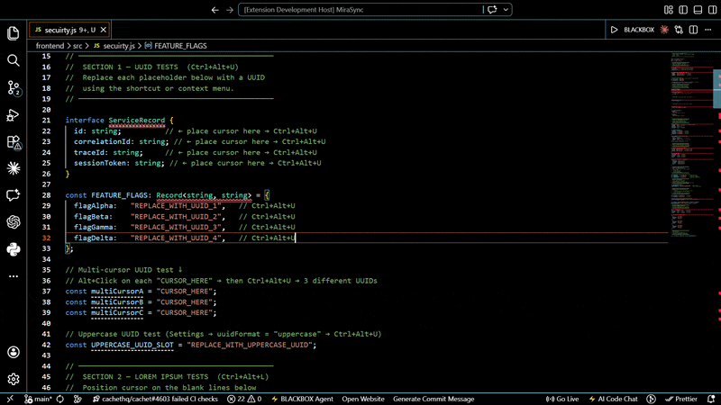

<div align="center">


<br/>
   <br/>
<a href="https://marketplace.visualstudio.com/items?itemName=Misrilal-Sah.insert-utilities"></a> <a href="https://marketplace.visualstudio.com/items?itemName=Misrilal-Sah.insert-utilities"></a> <a href="https://marketplace.visualstudio.com/items?itemName=Misrilal-Sah.insert-utilities"></a> <a href="LICENSE"></a><br/>
<sub><em>Stop switching tabs — insert UUIDs, Lorem Ipsum, timestamps &amp; random strings via shortcut, palette, or right-click</em></sub>
</div>

---

## ◈ Features at a Glance

<table>
<tr>
<td width="25%" align="center">
<h3>🔑</h3>
<strong>UUID Generator</strong><br/>
<sub>v4 &middot; lowercase &middot; uppercase &middot; no-dashes &middot; bulk insert</sub>
</td>
<td width="25%" align="center">
<h3>📝</h3>
<strong>Lorem Ipsum</strong><br/>
<sub>1 sentence &middot; 50 &middot; 150 &middot; 500 words &middot; custom length</sub>
</td>
<td width="25%" align="center">
<h3>🕐</h3>
<strong>Timestamps</strong><br/>
<sub>ISO 8601 &middot; Unix epoch &middot; 6 configurable formats</sub>
</td>
<td width="25%" align="center">
<h3>🎲</h3>
<strong>Random Strings</strong><br/>
<sub>alphanumeric &middot; hex &middot; numeric &middot; crypto-secure</sub>
</td>
</tr>
</table>

---

## ◈ Commands

| Command | Example Output | Shortcut |
|---|---|---|
| 🔑 **Insert UUID v4** | `f47ac10b-58cc-4372-a567-0e02b2c3d479` | `Ctrl+Alt+U` |
| 🔑 **Insert UUID v4 (Uppercase)** | `F47AC10B-58CC-4372-A567-0E02B2C3D479` | — |
| 🔑 **Insert UUID v4 (No Dashes)** | `f47ac10b58cc4372a5670e02b2c3d479` | — |
| 🔑 **Insert Multiple UUIDs** | Prompts for count, one per line | — |
| 📝 **Insert Lorem Ipsum (1 Sentence)** | Classic opening sentence | — |
| 📝 **Insert Lorem Ipsum (50 Words)** | Short paragraph block | — |
| 📝 **Insert Lorem Ipsum (150 Words)** | Medium paragraph block | `Ctrl+Alt+L` |
| 📝 **Insert Lorem Ipsum (500 Words)** | Long multi-paragraph block | — |
| 📝 **Insert Lorem Ipsum (Custom)** | Prompts for word count (1–5000) | — |
| 🕐 **Insert Current Timestamp** | Uses format from Settings | `Ctrl+Alt+T` |
| 🕐 **Insert ISO Timestamp** | `2026-04-03T14:30:45.000Z` | — |
| 🎲 **Insert Random String** | Quick Pick — 7 options | `Ctrl+Alt+R` |

> All commands available via **keyboard shortcut**, **`Ctrl+Shift+P`** Command Palette, and **right-click → ✨ Insert Utilities**

---

## ◈ Multi-Cursor Support

Place multiple cursors (`Alt+Click`) then run any command — **each cursor receives its own unique value**.

```
Cursor 1 → a1b2c3d4-e5f6-7890-abcd-ef1234567890
Cursor 2 → b2c3d4e5-f6a7-8901-bcde-f12345678901
Cursor 3 → c3d4e5f6-a7b8-9012-cdef-123456789012
```

> Timestamps are intentionally the same across all cursors — all log entries share the same moment.

---

## ◈ Keyboard Shortcuts

| Action | Windows / Linux | macOS |
|---|---|---|
| Insert UUID v4 | `Ctrl+Alt+U` | `Cmd+Alt+U` |
| Insert Lorem Ipsum (150 words) | `Ctrl+Alt+L` | `Cmd+Alt+L` |
| Insert Timestamp | `Ctrl+Alt+T` | `Cmd+Alt+T` |
| Insert Random String | `Ctrl+Alt+R` | `Cmd+Alt+R` |

Customize any shortcut: `Ctrl+K Ctrl+S` → search "Insert Utilities"

---

## ◈ Demo

<div align="center">

</div>

---

## ◈ Output Examples

**UUID**
```
f47ac10b-58cc-4372-a567-0e02b2c3d479        ← lowercase (default)
F47AC10B-58CC-4372-A567-0E02B2C3D479        ← uppercase
f47ac10b58cc4372a5670e02b2c3d479            ← no dashes
```

**Lorem Ipsum (50 words)**
```
Lorem ipsum dolor sit amet, consectetur adipiscing elit. Sed do eiusmod
tempor incididunt ut labore et dolore magna aliqua. Enim ad minim veniam,
quis nostrud exercitation ullamco laboris nisi aliquip ex ea commodo
consequat duis aute irure.
```

**Timestamps**
```
YYYY-MM-DD HH:mm:ss   →  2026-04-03 14:30:45
YYYY-MM-DDTHH:mm:ssZ  →  2026-04-03T14:30:45.000Z
MM/DD/YYYY HH:mm:ss   →  04/03/2026 14:30:45
DD/MM/YYYY HH:mm:ss   →  03/04/2026 14:30:45
MMMM DD, YYYY         →  April 03, 2026
Unix Epoch            →  1743692245
```

**Random Strings**
```
Alphanumeric (16):  aB3xK9mZpQ2rLw7Y
Hex (32):           3f9a2b1c4e8d07a51b6c3d2e5f4a7890
Number (6):         482930
```

---

## ◈ Settings

Open `Ctrl+,` and search **"Insert Utilities"**, or paste into `settings.json`:

```json
{
  "insertUtilities.uuidFormat": "lowercase",
  "insertUtilities.uuidIncludeDashes": true,
  "insertUtilities.loremStartWithClassic": true,
  "insertUtilities.timestampFormat": "YYYY-MM-DD HH:mm:ss",
  "insertUtilities.showNotification": true,
  "insertUtilities.randomStringCharset": "alphanumeric"
}
```

| Setting | Options | Default |
|---|---|---|
| `uuidFormat` | `lowercase` · `uppercase` | `lowercase` |
| `uuidIncludeDashes` | `true` · `false` | `true` |
| `loremStartWithClassic` | `true` · `false` | `true` |
| `timestampFormat` | 6 formats (see above) | `YYYY-MM-DD HH:mm:ss` |
| `showNotification` | `true` · `false` | `true` |
| `randomStringCharset` | `alphanumeric` · `alphabetic` · `numeric` · `hex` | `alphanumeric` |

---

## ◈ Why Insert Utilities?

| Feature | Insert Utilities | UUID Generator | Lorem Ipsum |
|---|---|---|---|
| UUID v4 | ✅ | ✅ | ❌ |
| UUID uppercase / no-dashes | ✅ | ⚠️ Some | ❌ |
| Multiple UUIDs | ✅ | ⚠️ Some | ❌ |
| Lorem Ipsum | ✅ | ❌ | ✅ |
| Timestamps | ✅ | ❌ | ❌ |
| Random strings (crypto) | ✅ | ❌ | ❌ |
| Multi-cursor unique values | ✅ | ⚠️ Varies | ⚠️ Varies |
| Zero external dependencies | ✅ | ⚠️ Varies | ⚠️ Varies |
| Keyboard shortcuts | ✅ | ⚠️ Varies | ⚠️ Varies |

---

## ◈ Installation

**Marketplace**

1. Open VS Code
2. Go to **Extensions** (`Ctrl+Shift+X`)
3. Search for **Insert Utilities**
4. Click **Install**

**Quick open:**

Press `Ctrl+P` and run:
```
ext install Misrilal-Sah.insert-utilities
```

**From the CLI:**

```bash
code --install-extension Misrilal-Sah.insert-utilities
```

---

## ◈ FAQ

**Are UUIDs cryptographically safe?**
Yes — generated with `crypto.randomUUID()`, RFC 4122 compliant.

**Does it install any packages?**
No. Zero runtime dependencies — only Node.js built-ins and the VS Code API.

**Multi-cursor inserts — same value or unique?**
UUID, Lorem Ipsum, and Random String commands generate a **unique value per cursor**. Timestamps are the same (intentional — all cursors share the same moment).

**Can I change keyboard shortcuts?**
Yes — `Ctrl+K Ctrl+S` → search "Insert Utilities" → reassign any binding.

---

## ◈ Contributing

1. Fork the [repository](https://github.com/Misrilal-Sah/Insert-Utilities)
2. Create a branch: `git checkout -b feature/my-feature`
3. Commit: `git commit -m 'Add my feature'`
4. Push: `git push origin feature/my-feature`
5. Open a Pull Request

---

## ◈ Changelog

See [CHANGELOG.md](CHANGELOG.md) for version history.

---

<div align="center">

   

<a href="https://github.com/Misrilal-Sah/Insert-Utilities"></a> <a href="https://marketplace.visualstudio.com/items?itemName=Misrilal-Sah.insert-utilities"></a> <a href="https://github.com/Misrilal-Sah/Insert-Utilities/issues"></a> 

<sub>Built by <a href="https://github.com/Misrilal-Sah"><strong>Misrilal Sah</strong></a> · <a href="https://misril.dev">misril.dev</a> · <a href="CHANGELOG.md">Changelog</a> · <a href="LICENSE">MIT</a></sub>


</div>